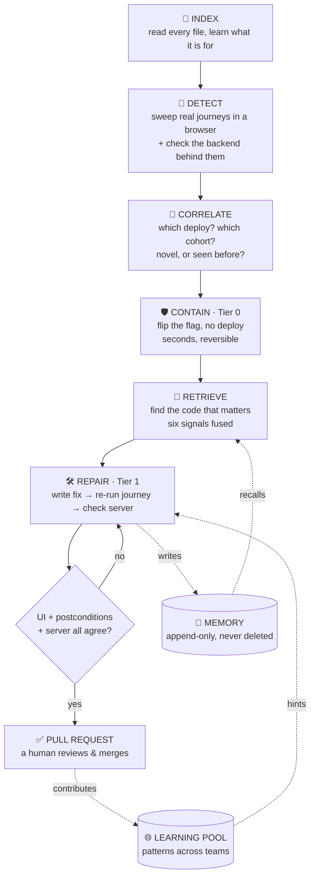
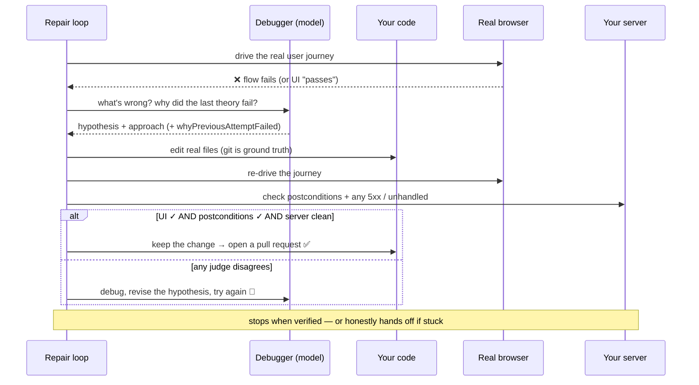
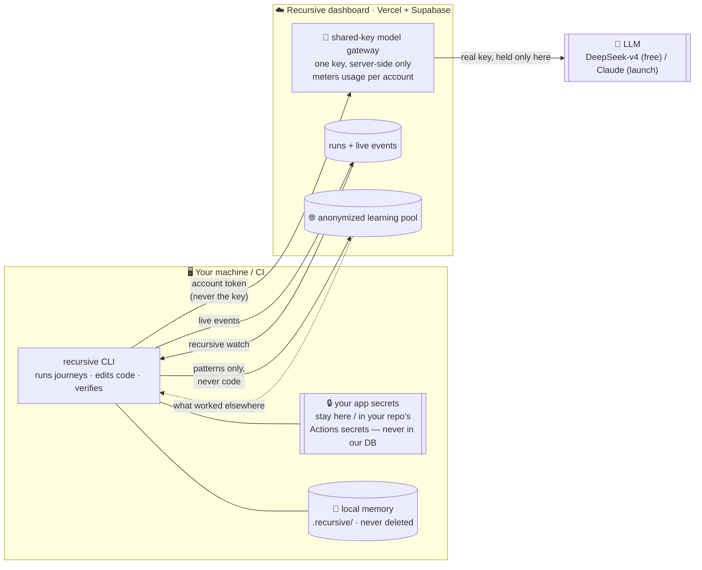
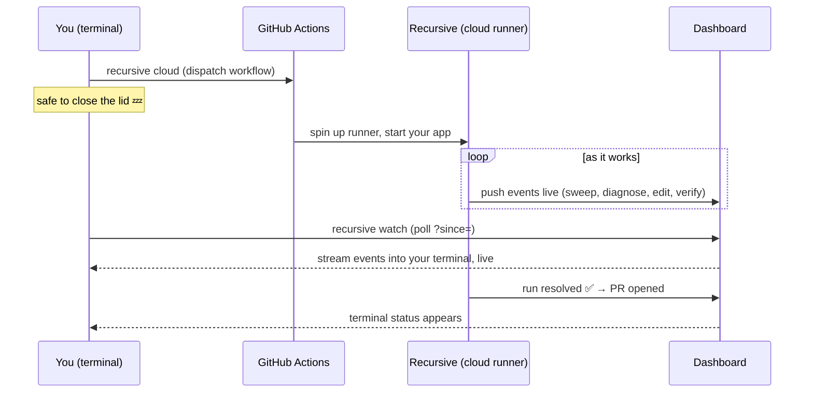
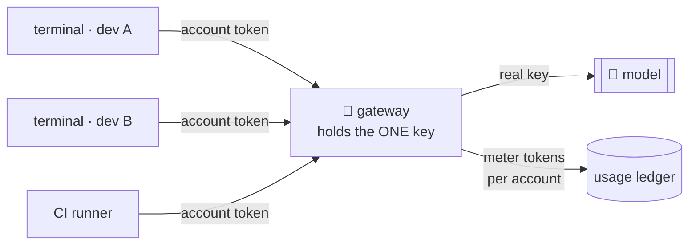
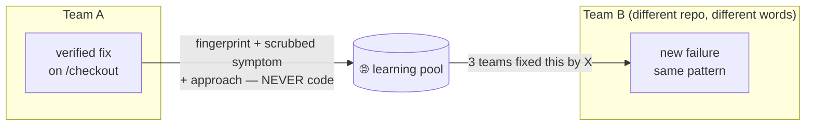

# Recursive

> **Software that finds its own breakage, contains it, and opens a verified fix — from your terminal, or in the cloud while you keep working.**


Recursive installs into a repository, learns what the codebase does, watches for
failures (including the silent ones that throw no exception), and repairs them by
writing code and re-testing the **real user journey** until it genuinely passes —
then opens a pull request.

It is not a linter and not a monitoring dashboard. It is a **closed loop**:
detect → diagnose → change the code → verify against reality → try again if the
change did not work. It runs from your terminal, can run in the **cloud** on
GitHub's servers while you keep working, and **streams live** so you can see it's
genuinely Recursive's agent doing the work — not some IDE assistant.



See [ARCHITECTURE.md](ARCHITECTURE.md) for the deeper design and trust model.

```bash
npm install && npx playwright install chromium
npm run cli -- demo        # seeds a real scenario and runs detect then contain
```

---

## Table of contents

1. [The problem](#the-problem)
2. [How it works end to end](#how-it-works-end-to-end)
3. [Architecture at a glance](#architecture-at-a-glance)
4. [Install it into your project](#install-it-into-your-project)
5. [The three tiers](#the-three-tiers)
6. [Cloud runs and live streaming](#cloud-runs-and-live-streaming)
7. [Accounts and the shared model key](#accounts-and-the-shared-model-key)
8. [The learning flywheel](#the-learning-flywheel)
9. [Components in detail](#components-in-detail)
10. [Measured results](#measured-results)
11. [CLI reference](#cli-reference)
12. [Web dashboard](#web-dashboard)
13. [Configuration](#configuration)
14. [Security and privacy](#security-and-privacy)
15. [Testing](#testing)
16. [Limitations and what is not done](#limitations-and-what-is-not-done)
17. [Repository layout](#repository-layout)

---

## The problem

Error tracking answers *"what threw?"*. That misses the failure mode that costs
the most money.

| Failure mode | Throws? | Ticket filed? | Caught by | Time to detect |
|---|---|---|---|---|
| Server 500s | yes | yes | APM | minutes |
| Uncaught JS exception | yes | rarely | error tracking | hours |
| **Button silently stops firing** | **no** | **no** | **nothing** | **weeks, or never** |
| **Form submits into the void** | **no** | **no** | **nothing** | **weeks, or never** |

A click handler throws before it reaches the network call. A form submits and
the screen says "Order confirmed" while the server never heard about it. A
checkout flow works on desktop and is broken only on mobile Safari. Nothing
crashes, nobody complains, users just leave, and the revenue graph looks like
seasonality.

Recursive is built around that class of failure specifically, then extended to
ordinary loud failures too, because once you have the machinery for the hard
case the easy case is nearly free.

Three things make the silent case tractable:

1. **Behavioural telemetry.** Dead clicks, rage clicks and quick-backs are
   evidence that a user tried something and it did not work, even when the
   application believes everything is fine.
2. **Ground truth outside the UI.** The screen saying "Order confirmed" is not
   evidence an order exists. Checking that the order count actually moved is.
3. **Git as the change oracle.** You do not need the customer to call
   `recordRelease()` from their CI. The repository already knows what shipped,
   when, which files changed, and which parts of the codebase are churning.

---

## How it works end to end

The top-of-page diagram shows the whole pipeline. The loop that matters most is
**Tier 1 repair**, because it is where "self-healing" stops being a slogan and
becomes a checkable claim. A fix is not "done" because an agent said so. It is
done only when the user journey has been driven again in a real browser, the
business postconditions hold, and the server shows no errors — **all three must
agree**:



The three judges are deliberately independent: a browser that says "Order
confirmed" is not proof an order exists, so Recursive also checks the count moved
*and* that the backend didn't 500 behind the green screen.

---

## Architecture at a glance

Two halves. Your machine (or CI) runs the loop and edits code; a hosted dashboard
holds the shared model key and the cross-team memory. **Your app's secrets never
leave your side, and your code never enters our database** — only anonymized
patterns do.



Everything runs by executing TypeScript directly — **no build step** — so the CLI
is `node --experimental-strip-types src/cli.ts` under the hood, and installs into
any repo without a compile.

---

## Install it into your project

Requirements: **Node.js 22.6 or newer** (Recursive runs TypeScript directly, no
build step), **git**, and **Chromium** via Playwright.

```bash
npm install -g github:npmiaman/recursive
npx playwright install chromium
```

Then, from inside the project you want it to watch over:

```bash
cd /path/to/your/app

recursive init            # register this project, write a flow manifest + .env template
# put a model key in .env  (free: build.nvidia.com, see below)
recursive doctor          # confirm every subsystem works here
recursive memory index    # learn this codebase
recursive sweep daily     # test it in a real browser
recursive sweep daily --repair   # and fix what breaks
```

`recursive init` keeps everything with your project: its memory lives in
`.recursive/` (add it to `.gitignore`), and the flow manifest and `.env` sit at
the repo root. Nothing is stored in the global install, so each project keeps its
own memory that is never deleted.

The one thing to edit by hand is `recursive.flows.json`: describe the user
journeys that matter (see [docs/testing.md](docs/testing.md) for the format and
how to expose the test/trace endpoints that let Recursive check your backend).

### Free model in two minutes

Recursive needs a model for indexing, diagnosis, and code-writing. Any
OpenAI-compatible endpoint works; the free option is NVIDIA's:

```bash
# in your project's .env
LLM_PROVIDER=openai
OPENAI_BASE_URL=https://integrate.api.nvidia.com/v1
OPENAI_MODEL=deepseek-ai/deepseek-v4-flash
OPENAI_API_KEY=nvapi-...      # free at build.nvidia.com, no card
OPENAI_RPM=40
FIX_ENGINE=agentic
```

### Developing Recursive itself

```bash
git clone https://github.com/npmiaman/recursive.git
cd recursive && npm install && npx playwright install chromium
cp .env.example .env          # set your keys
npm run cli -- demo           # seeded end-to-end scenario, no keys needed
```

From the source checkout, use `npm run cli -- <command>` in place of the
`recursive <command>` binary. Then run it:

```bash
npm run cli -- sweep daily                 # test everything important
npm run cli -- sweep pr --base main        # test only what a diff put at risk
npm run cli -- sweep daily --repair        # and fix what breaks
```

To see the whole system on a seeded scenario without touching a real app:

```bash
npm run cli -- demo
```

---

## The three tiers

Recursive deliberately stops at Tier 1. Tier 2 is absent on purpose, not because
it was hard.

| Tier | What it does | Speed | Reversibility | Implemented |
|---|---|---|---|---|
| **Tier 0: contain** | Turn off a flag, serve a directive to the SDK. No deploy, no code change. | Seconds | One inverse operation | Yes |
| **Tier 1: repair** | Write code, verify against the real journey, open a pull request. | Minutes | Normal code review | Yes |
| **Tier 2: auto-deploy** | Ship to production without a human. | n/a | n/a | **No, by design** |

Containment and repair are different jobs on different clocks. When checkout is
broken, the useful thing to do in the first thirty seconds is stop the bleeding,
not open a pull request. Turning a flag off is reversible by a single inverse
operation, which makes it safe to automate in a way that shipping code never is.

Every Tier 0 action passes through **guardrails** that are deterministic and
auditable by construction:

- Blast radius is bounded *before* it is calculated, by rules the agent cannot
  alter.
- Rate limits per hour, and a cooldown per target rather than per incident.
- An allowlist of permitted action types per project.
- Low-confidence incidents are refused. If the cause is not attributable,
  containment would be a guess.

Every decision, allowed or blocked, is written to an append-only audit log.

---

## Cloud runs and live streaming

Recursive is terminal-native, but it doesn't need your laptop open. A run can
execute on GitHub's servers while you keep working, and stream back to any
terminal so you can watch it happen.



| Command | What it does |
|---|---|
| `recursive cloud` | Dispatch a sweep + repair onto GitHub Actions and stream it here. Needs `recursive ci` committed once, and `gh` (or `GITHUB_TOKEN`). |
| `recursive watch [runId]` | Follow a run live in this terminal. No id = your latest run. Ctrl-C detaches; the run keeps going. |
| `recursive sweep --detach` | Run locally in the background and hand your shell back. Follow with `watch`. |
| `recursive ci` | Write the `.github/workflows/recursive.yml` that runs Recursive in the cloud on a schedule + on demand. |

Live streaming is **best-effort and never blocks the fix loop** — every event is
written to disk first and mirrored to the dashboard, so a network blip degrades
the live view, never the run. GitHub Actions runs turn streaming on
automatically; locally it's on for `cloud` / `watch` / `--detach`.

---

## Accounts and the shared model key

You sign up once on the dashboard, then `recursive login` connects **any**
terminal — your laptop, a teammate's, a CI runner — to that same account, using a
device-code flow like `gh auth login` (the CLI never sees a password).

The account is also how the **shared model key** works. Instead of every
developer pasting a model key into every project, the key lives in exactly one
place — the dashboard's gateway, server-side — and each terminal authenticates
with its **account token**. The gateway forwards the request to the model with
the real key and records exactly how much that account used.



- **One key, no spread.** Nobody but the server holds it; rotating it is one env
  change, and no developer machine has to be touched.
- **Per-account metering + rate limits.** The dashboard shows precisely which
  account used how much, and caps requests per account so one runner can't starve
  the rest.
- **Invite-only signup, revocable terminals.** New accounts need the owner's
  signup code; any connected terminal can be revoked server-side, killing a
  captured token everywhere at once.

---

## The learning flywheel

Recursive gets better as more people use it, without any code leaving a machine.

When a fix is **verified**, Recursive contributes a *pattern* to a shared pool:
a fingerprint of the failure (its signal class + the shape of the route, e.g.
`/orders/12345` → `/orders/:id`), a scrubbed one-line symptom, and the approach
that worked. Before diagnosing a new failure, it asks the pool *"what worked for
this pattern elsewhere?"* and leads the fix agent with the answer.



**What travels, and what never does:**

| Leaves the machine | Never leaves the machine |
|---|---|
| Failure fingerprint (signal + route shape) | Your code |
| Scrubbed, truncated one-line symptom | File names, repo names |
| The approach that worked | Stack traces, secrets, PII |

Opt out entirely with `RECURSIVE_NO_SHARE=1`. And `recursive export` dumps your
*own* project's full memory as JSONL — un-anonymized, local, whole — a ready-made
fine-tuning / eval dataset of your own history.

---

## Components in detail

### Base memory: what Recursive knows about your codebase

The first time Recursive runs it reads every file and records two tiers of
knowledge.

**Tier 1 is structural** and free: exports, imports, symbols, language, size,
and how many other files depend on this one (the blast radius if it breaks).

**Tier 2 is semantic** and uses a model: what this file is FOR in domain terms,
what concepts it deals with, what breaks if it is wrong, which routes it serves,
whether it is business critical, and which user journeys it participates in.

Tier 2 is the part that matters, and it exists to solve a specific measurable
problem. A bug report says "the buy button does nothing". The file is called
`CheckoutButton.tsx` and contains `submitOrder` and `useOrderMutation`.
Structural data shares no vocabulary with that report and cannot bridge it. Only
a summary written in domain language can.

Base memory also replaces several hardcoded heuristics elsewhere in the system.
Route criticality used to be guessed from URL spelling against an English word
list, which fails immediately for a bank whose payment flow is `/txn/initiate`.
Now it comes from what the code actually does.

Base memory is **append-only**. A changed file gets a new record and the old one
stays, so "what did this file used to do?" remains answerable.

### Retrieval: finding the code that matters

No single signal is reliable alone. Stack traces are precise but silent failures
do not produce them. Git tells you what changed but not which change is to
blame. Keyword search misses fixes that live one import away from anything the
failure mentions.

So six independent retrievers run and their rankings are fused with **Reciprocal
Rank Fusion**. RRF combines *ranks* rather than scores, which matters because
BM25 scores, git churn counts and graph hop-distances live on wildly different
scales and cannot be meaningfully added. It needs no training data and degrades
gracefully: a failure with no stack trace simply loses one voter.

| Signal | Weight | What it is |
|---|---|---|
| Stack frames | 3.0 | Close to fact rather than inference |
| Symbols | 2.5 | An identifier resolving to a definition is an address, not a guess |
| Git changed | 2.0 | What shipped just before this broke |
| Lexical (BM25) | 1.0 | Keyword overlap, code-tuned |
| Semantic | 1.0 | Optional embedding retriever |
| Base memory | 0.3 | What the file is FOR. Deliberately weak, see below |
| Import graph | 0.25 | Adjacency is a hint, not a finding |

Details arrived at by measurement rather than taste:

- **BM25 length normalization is `b = 0.4`, not the textbook `0.75`.** Code
  files are long, and the textbook value punished them so heavily that the file
  mentioning the query terms 34 times ranked 13th.
- **Hub files are excluded from graph expansion.** `config.ts` and `types.ts`
  sit one hop from everything and won every query.
- **RRF is blended with score magnitude.** Pure RRF flattened a decisive 1.8x
  BM25 win into a near-tie that any weak second signal could reorder.
- **Base memory is weighted below lexical.** The first attempt weighted it at
  1.4, above keyword search, reasoning that semantic understanding beats keyword
  overlap. That was wrong and cost recall@3 (92 percent down to 75 percent) by
  displacing correct hits with plausible ones. This signal is inference about
  purpose, not evidence of a match, so it must not outvote a real hit. Its job
  is to break ties and to rescue queries where lexical finds nothing at all.
- **The tokenizer stems.** A report saying "chunking splits functions" shares
  zero tokens with `chunk.ts` and `chunkFile`. Five conservative suffix rules
  emit the stem alongside the original, so exact identifier matches keep full
  weight while morphological variants become reachable. Deliberately not Porter,
  which mangles code vocabulary ("routes" to "rout", "caching" to "cach").

### The closed repair loop

This is what makes "self-healing" a checkable claim rather than a marketing word.

```
verify the flow in a real browser  ->  it fails
ask the debugger what to do        ->  a hypothesis and an approach
apply a change to real files       ->  git is ground truth, not the agent's claim
verify AGAIN in a real browser     ->  did the USER JOURNEY pass?
check business postconditions      ->  did the order count actually move?
check the server                   ->  any 5xx or unhandled exception?

   all three agree  ->  done
   otherwise        ->  debug, revise the hypothesis, try again
```

Three properties are load-bearing.

**Traces are never replayed during verification.** A recorded trace describes
the app as it was BEFORE the fix. Replaying it would either follow a path that
no longer exists or, worse, pass by luck without exercising the change at all.

**The debugger must explain why the last theory was wrong before proposing a new
one.** The most common failure mode in automated repair is re-trying variations
of an idea that was already disproven. The schema forces
`whyPreviousAttemptFailed` and a `hypothesisChanged` boolean.

**The loop can admit defeat.** If the diagnosis stops changing across two cycles
while the flow stays broken, it stops and hands off to a human with the full
evidence trail and a list of what it would need to see to be confident. A loop
that cannot give up is a loop that burns budget forever.

Fixes land on **long-lived per-area git branches** (`recursive/frontend`,
`recursive/backend` and so on) rather than one throwaway branch per incident,
because that is how actual teams work, and because a branch per incident
produces pull requests nobody reviews.

The coding agent is explicitly instructed to **repair the behaviour, not remove
the feature**. Deleting a broken checkout button would make the test pass and is
never the fix.

### Verification: never trust the UI

A flow that only checks "the screen looked right" is checking the wrong thing.
Three independent judges must agree:

1. **The user journey completed.** A browsing agent drove it in a real browser.
2. **Business postconditions hold.** Assertions made from outside the UI: an
   HTTP check, an absence check, or a count-delta such as "the order count must
   go up by exactly one".
3. **The server behaved.** No 5xx, no unhandled exception, and the calls the
   flow normally makes actually happened.

When the UI reports success and ground truth disagrees, that is flagged as
`uiLied`, and it is the highest-value finding a sweep can produce: a bug no
amount of manual clicking would catch, because it looks correct.

### The internal browsing agent

Recursive ships its own browsing agent rather than depending on an external one,
because bringing it in-house allowed three optimisations that matter at the
scale of a nightly sweep.

**Element indexing instead of screenshots.** The agent receives a numbered list
of interactive elements rather than an image. Measured at **10.7x cheaper** in
tokens on a representative page.

**Trace record and deterministic replay.** A flow that succeeded once is a
script. The expensive part, working out what to click, has already been done.
Replaying a recorded trace with ranked selectors and per-step expectations costs
**zero model calls**. Only a page that actually changed needs thinking.

**Replay first, model as fallback.** If replay stops at a changed step, the
agent resumes from exactly that step rather than starting over.

A full sweep of unchanged flows can therefore run with **no API key at all**.

### Memory: nothing is ever deleted

Per project, append-only, on disk via `node:sqlite` with no external dependency.
It records:

- Every failure, with a stable fingerprint so recurrence is detectable
- Every fix attempt, **including the ones that failed**, with the reasoning
- Whether the fix actually held days later
- Lessons derived across cases

The write path is a single `append()` function. There is no `update()` and no
`delete()`, by construction rather than by policy.

When a new failure arrives, five matchers score similarity (fingerprint, file
overlap, lexical, location, class). If this exact defect has occurred before,
the prompt leads with a blunt warning and then lists **approaches already tried
and rejected**, so the loop does not waste cycles re-deriving them.

Storing the failures is the point. A diff tells you what was done. Only the
reasoning tells you what was believed and whether that belief held.

### Cohort analysis

A failure that hits everyone equally is a bug. A failure that hits only mobile
Safari users in one country is a different bug with a different cause, and
averages hide it completely.

Each group is compared against everyone else with a **two-proportion z-test**,
then three gates apply, and they exist to stop the analysis producing confident
nonsense:

- **Minimum sample size.** A 75 percent failure rate across 12 sessions is not a
  finding.
- **Effect size threshold.** A statistically real 1.10x difference is not worth a
  human's attention.
- **Bonferroni correction.** Testing 200 cohorts at p < 0.05 produces 10 false
  positives by definition. The correction is applied, and the suite contains a
  case that passes uncorrected and correctly fails corrected.

---

## Measured results

Real measurements from the test suite in this repository, not projections. Where
a number has a caveat, the caveat is stated.

### Retrieval

Measured on a 12-query benchmark (`test/retrieve-eval.ts`) against this
repository: 115 files, 704 chunks.

| Stage | recall@1 | recall@3 | recall@5 | MRR |
|---|---|---|---|---|
| Baseline | 33% | 67% | 67% | 0.486 |
| Plus stemming | 42% | 67% | 67% | 0.528 |
| Plus untracked-file fix | 67% | 92% | 92% | 0.790 |
| Plus base memory (real model) | **75%** | **92%** | **92%** | **0.833** |

The largest single jump came from a bug, not a feature. `git ls-files` returns
only *tracked* files, so 45 of 88 source files were invisible to retrieval, and
invisible *silently*, producing a confidently wrong answer rather than an error.
That is exactly backwards for a tool that investigates fresh breakage, because
the code most likely to be at fault is the code somebody just wrote.

The base-memory row is measured with real model summaries: 108 of 119 files
enriched by DeepSeek V4-Flash on NVIDIA's free endpoint. An earlier run with a
hand-written mock provider scored one query higher on recall@1 and one on
recall@5 (83% / 100%), because the mock's summaries used benchmark-friendly
vocabulary. On 12 queries that is within noise, and recall@3 is identical at
92% either way, so the mock was a fair proxy but slightly optimistic. The 0.3
weight is tuned on 12 queries, too few to trust a peak, so it sits at the centre
of the flat region of a parameter sweep rather than at the argmax.

`recall@3` is the number that matters in practice, because the fix agent is
handed roughly 10 chunks. `recall@1` is a stricter bar than the system requires.

### Browsing agent

| Measurement | Result |
|---|---|
| Element indexing vs screenshot | 103 tokens vs roughly 1100, **10.7x cheaper** |
| Replay of an unchanged flow | 2 steps in 629ms, **0 model calls** |
| Replay when a step changed | Stops at the changed step, agent resumes there |

### Cohort analysis

On seeded data with a planted signal, the mobile checkout cohort is correctly
identified as **25.5x worse** (68.2 percent versus 2.7 percent), while
`/pricing`, which is uniformly bad for everyone, is correctly excluded because it
is not a cohort effect.

### Closed loop

`test/closed-loop.test.ts` runs the whole loop against a genuinely broken page
using real Chromium, real HTTP and real file writes, with a stubbed model for
determinism. The run captures the property the design exists for:

```
confirmed broken: PASS - Order placed! is shown.
```

The UI reported success. The loop overruled it because no order reached the
server, applied a fix, re-drove the journey, and verified against the order
count.

---

## CLI reference

```
npm run cli -- <command>
```

### Understanding the codebase

| Command | What it does |
|---|---|
| `memory index --repo PATH` | Build base memory. `--no-enrich` for structural only, `--full` to re-index everything |
| `memory` | What this project has learned: counts, lessons, hit rate |
| `memory search "..."` | Find past failures similar to a description |
| `retrieve --message "..."` | Find the code relevant to a failure |

### Testing what works

| Command | What it does |
|---|---|
| `sweep init` | Write a starter `recursive.flows.json` into the repo |
| `sweep pr --base REF` | Test only the flows a diff put at risk. Gates a merge |
| `sweep daily --max N` | Test every core flow plus the highest-risk remainder |
| `sweep --repair` | Fix what breaks instead of only reporting it |
| `sweep --detach` | Run in the background; keep working, follow with `watch` |
| `sweep --dry-run` | Show the plan without running |
| `sweep --watch` | Show the browser instead of running headless |
| `sweep --engine E` | `internal` (fast, default) or `rhai` |

### Repairing

| Command | What it does |
|---|---|
| `repair FLOW_ID` | Fix a failing flow, verifying after every change |
| `repair FLOW_ID --cycles N` | Cap attempts (default 4) |
| `repair FLOW_ID --only PATHS` | Restrict which paths the agent may edit |
| `repair FLOW_ID --no-pr` | Commit to the area branch without opening a pull request |
| `repair FLOW_ID --dry-run` | Diagnose and verify, change nothing |

### Detecting and containing

| Command | What it does |
|---|---|
| `snapshot --dimensions URL,Device` | Pull Clarity data into the local time series |
| `diagnose` | Rank friction issues from the latest snapshot |
| `cohorts --dimension Device` | Find groups hit far harder than everyone else |
| `incidents` | Correlate failures to the release that caused them |
| `heal` | Tier 0 containment. `--dry-run` to see what it would do |
| `containment` | Did the containment actually work? |
| `audit` | The full decision trail, including blocked actions |

### Cloud, accounts, and setup

| Command | What it does |
|---|---|
| `init` | Set up Recursive in the current project (run this first) |
| `login [url]` | Connect this terminal to your dashboard account (shared key, no key stored locally) |
| `config nvidia <key>` | Set a free NVIDIA model key, once, for every project |
| `doctor` | Verify every subsystem works against this codebase, with a real model call |
| `ci` | Write the GitHub Actions workflow that runs Recursive in the cloud |
| `cloud` | Dispatch a cloud run on GitHub and stream it here |
| `watch [runId]` | Follow a run live in this terminal (no id = latest) |
| `export --out FILE` | Dump this project's memory as a JSONL training dataset |

### Other

| Command | What it does |
|---|---|
| `demo` | Run a seeded silent-breakage scenario end to end |
| `projects` | List configured projects and their autonomy settings |
| `engines` | Which coding engines are available, and their licence position |
| `status` | Current state |

---

## Web dashboard

A Next.js 15 application in `apps/web`, built with shadcn/ui primitives.

```bash
cd apps/web
npm install
npm run dev        # http://localhost:4400
```

In production it runs on **Vercel** with a **Supabase Postgres** database.

Pages:

- `/` landing page
- `/signup` (invite-only) and `/login`
- `/device` terminal approval for `recursive login`
- `/dashboard` connection state, live usage vs your rate limit, and (for the
  owner) a team-usage table of which account used how much
- `/dashboard/runs/[id]` one run in full, with the complete timeline, streamed
  **live** while it's still running
- `/dashboard/insights` is Recursive actually working
- `/dashboard/settings` connected terminals (revoke any), change password

Behind the pages sit the API routes the CLI talks to: the **model gateway**
(`/api/model/*`, shared key + per-account metering + rate limit), **runs**
(`/api/runs` for ingest and live append, `/api/runs/:id` for the live poll the
`watch` command reads), the **learning pool** (`/api/learnings` + `/search`), and
the **device-code** auth endpoints.

The run detail page is the important one. When Recursive claims it fixed
something, that page has to be enough to check the claim without trusting it:
which files retrieval surfaced, what it believed was wrong, what it changed, and
what happened when the journey was re-driven afterwards. Runs that failed get the
same treatment, because a system that only shows its wins is not auditable.

Two rules govern the insights page:

1. Every rate carries its denominator. A percentage without a sample size is a
   lie waiting to happen.
2. "Not enough data yet" is shown as itself rather than as 0 percent, because a
   confident zero reads as failure when it actually means silence.

**Authentication** uses a device-code flow, the same shape as `gh auth login`.
The CLI never sees a password. It polls with a device code and receives a token
only after a human who is already signed in approves it in a browser. Signing
out revokes the session server-side rather than only clearing the cookie, so a
captured token is dead everywhere rather than merely unsent by one browser.

---

## Configuration

All configuration is via `.env`. Copy `.env.example` and fill it in.

| Variable | Purpose |
|---|---|
| `ANTHROPIC_API_KEY` | Claude, the default provider |
| `LLM_PROVIDER` | `anthropic` or `openai` |
| `OPENAI_BASE_URL` | Any OpenAI-compatible endpoint (Ollama, vLLM, LM Studio) |
| `OPENAI_MODEL` | Model name for that endpoint |
| `TARGET_REPO_PATH` | The repository Recursive may edit |
| `CLARITY_API_TOKEN` | Microsoft Clarity Data Export API |
| `FIX_ENGINE` | `claude-agent-sdk` or `openhands` |

### Coding engines

| Engine | Licence | Zero egress | When to use |
|---|---|---|---|
| Claude Agent SDK (default) | Anthropic Commercial Terms | No, prompts reach the API | Best available quality |
| OpenHands | MIT | Yes, point it at a model you host | Source cannot leave the network (BFSI, regulated GCC work) |

Both produce the same thing: edits in a working tree that the loop then measures
and keeps or reverts. Nothing downstream of that interface knows or cares which
engine ran.

### Microsoft Clarity limits

Worth knowing before designing around it. The Data Export API allows **10
requests per project per day**, a **1 to 3 day lookback**, **1000 rows**, **no
pagination**, and a maximum of **3 dimensions per call**.

This is why Clarity drives target *selection* but is never used as the scorer
inside a hill-climb. Ten calls a day cannot measure an optimisation loop. A fast
local probe does that, and Clarity confirms the result afterwards.

---

## Security and privacy

**Keys belong in `.env` and nowhere else.** Never in a chat message, a ticket or
a commit. `.env` is gitignored. Any key that has been pasted anywhere should be
treated as compromised and rotated.

**PII scrubbing runs in two passes**, once at the SDK edge and once on server
ingest. The scrubber ordering is load-bearing, and any change to it needs a test
against a payload carrying every secret type. A 10-case regression suite exists
because an earlier version leaked a bearer token: the pattern matched only the
word "Bearer" and left the credential behind. Indian mobile numbers were not
caught at all.

**Memory holds code, failures and reasoning. It does not hold personal data.**

**Guardrails, statistics, probe scoring and PII scrubbing are deterministic.**
They are auditable and have no network dependency. This is deliberate. A model
deciding whether an automated production action is permitted would make the
system unreviewable.

**The web database is never committed.** It holds account rows, password hashes
and live session tokens. Passwords use scrypt with per-account salts and
constant-time comparison. Session tokens are stored hashed.

**Your app's secrets stay on your side.** When Recursive runs in CI it reads only
the *names* of the env vars your app declares (to wire them as GitHub Actions
secrets), never the values, and never stores them in our database. The one shared
secret — the model key — lives only in the gateway's server-side env and never
touches a developer machine.

**The learning pool is pattern-only by construction.** What can leave a machine
is a failure fingerprint, a scrubbed one-line symptom, and the approach that
worked. Code, file names, repo names, stack traces, and anything the scrubber
recognises as secret or PII never enter it. `RECURSIVE_NO_SHARE=1` opts out
entirely.

---

## Testing

```bash
npm run typecheck                    # tsc, no emit
npm test                             # scrub, retrieve, memory, cohort (41 checks)
npm run test:loop                    # the full closed repair loop, real browser
npm run test:browse                  # browsing agent, needs: node fixtures/serve.mjs &
npm run eval:retrieve . demo-shop    # the retrieval benchmark
```

The tests are written as regressions against failures actually found by
measurement, and each documents the failure it pins down. A few examples:

- BM25 length normalization ranked the correct file 13th
- The PII scrubber persisted a bearer token it claimed to redact
- The same feature flag was contained twice, because the cooldown was per
  incident rather than per target
- The symbol index matched the English word "signals", because it was a local
  variable in five files

`test/closed-loop.test.ts` is the most valuable one. It runs the entire repair
loop end to end with no API key, against a page broken in the specific way that
motivates the whole project.

---

## Limitations and what is not done

Stated plainly, because a README that only lists strengths is not useful.

- **It only tests journeys it knows about.** Coverage is your `recursive.flows.json`
  plus routes it can auto-discover. A broken flow nobody described won't be swept.
- **It's built for web apps.** Browser-driven sweeps, Next/Vite detection. Not
  mobile apps, and not purely backend services (though the backend-verify check
  helps on the API side).
- **The app has to boot.** In the cloud it starts your app with your secrets; if
  it can't start, there's nothing to sweep.
- **Repair quality tracks the model, and it will hand off.** Deep architectural
  bugs or fixes needing product/design judgment are handed to a human rather than
  guessed at — a confident wrong fix is worse than an honest "I'm stuck".
- **A human still owns the merge** unless you explicitly enable `--auto-merge`.
  It is not a substitute for review on risky changes. **Tier 2 (auto-deploy) does
  not exist and is not planned.**
- **Cloud means GitHub Actions.** It needs a GitHub repo with Actions enabled;
  it is not a bespoke always-on cloud. Detection-only sweeps (no `--repair`) do
  not create a streamable run.
- **The free testing model is rate-limited** (NVIDIA, 40 RPM) — fine for trials,
  not production throughput until a paid key is wired (a one-command swap).
- **Base memory enrichment is measured on only one model.** DeepSeek V4-Flash
  (NVIDIA free tier) was used for the real run above. Other models are untested,
  and enrichment quality on a large unfamiliar codebase is still unknown.
- **The retrieval benchmark is 12 queries on one repository.** Enough to catch a
  regression, far too few to claim generality. The benchmark file is excluded
  from its own results (it contains every query verbatim).
- **Cohort analysis needs volume.** At low traffic the sample-size gate will
  correctly refuse to report anything — right, but can look like the feature is
  broken.
- **Not yet run against a large production codebase.**

---

## Repository layout

```
src/
  clarity/      Clarity client, budget ledger, mock data
  detect/       Signal ingest, health, incident correlation
  diagnose/     Issue extraction, severity ranking, cohort analysis
  retrieve/     BM25, symbols, import graph, stack parsing, RRF fusion
  memory/       Append-only store, base memory, matching, recall
  repo/         Git as change oracle, area classification, branches
  browse/       Internal browsing agent: observe, trace, replay, pool
  sweep/        Flow manifest, risk scoring, verification, backend checks
  loop/         Inner hill-climb, outer loop, closed repair loop, debugger
  agents/       Investigation, research, coding-engine adapters
  heal/         Tier 0 containment and guardrails
  llm/          Provider abstraction (Anthropic, any OpenAI-compatible)
  score/        Headless probes and instrumentation
  session/      Run recorder + live streaming to the dashboard
  learn/        Cross-team pool: anonymize (patterns only) + upload/search
  auth/         Device-code login, credential storage

apps/web/       Next.js dashboard (Vercel + Supabase in prod)
packages/       Browser SDK and server SDK (backend-verify trace endpoint)
test/           Regression suites and the retrieval benchmark
fixtures/       Static pages for browsing-agent tests
docs/           Additional notes
ARCHITECTURE.md Deeper design rationale
program.md      Product context, treated as binding by the agents
```

---

## Status

Working prototype under active development. The pipeline runs end to end and
every measurement above is reproducible from the test suite. The honest reading
of the limitations section is that the machinery is real while the evidence base
is still small.
